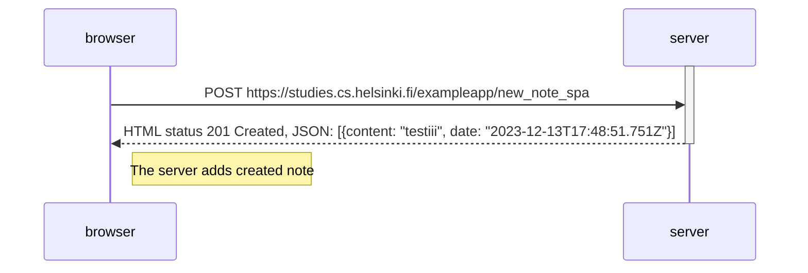

```mermaid

sequenceDiagram
    participant browser
    participant server
    
    activate server
    browser->>server: POST https://studies.cs.helsinki.fi/exampleapp/new_note_spa
    server-->>browser: HTML status 201 Created, JSON: [{content: "testiii", date: "2023-12-13T17:48:51.751Z"}]
    deactivate server
  

    Note right of browser: The server adds created note

```